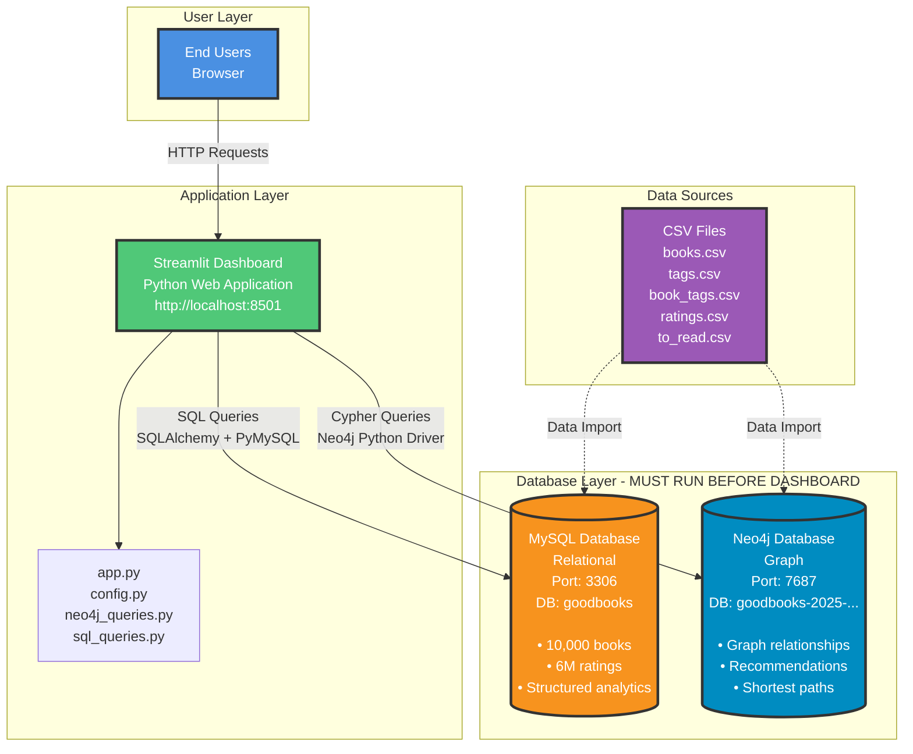

# System Architecture Diagram

## Mermaid Diagram (for Markdown/Notion/etc.)



## ASCII Diagram

```
┌─────────────────────────────────────────────────────────────────┐
│                    END USERS (Browser)                          │
└───────────────────────────┬─────────────────────────────────────┘
                             │ HTTP Requests
                             ▼
┌─────────────────────────────────────────────────────────────────┐
│              STREAMLIT DASHBOARD (Python Web App)               │
│                    http://localhost:8501                         │
│                                                                  │
│  Files: app.py | config.py | neo4j_queries.py | sql_queries.py  │
└──────────────┬──────────────────────────────┬───────────────────┘
               │                              │
               │ SQL Queries                 │ Cypher Queries
               │ (SQLAlchemy + PyMySQL)      │ (Neo4j Python Driver)
               │                              │
               ▼                              ▼
┌──────────────────────────┐    ┌──────────────────────────────┐
│   MYSQL DATABASE          │    │   NEO4J DATABASE              │
│   (Relational)            │    │   (Graph)                     │
│                           │    │                               │
│   Port: 3306              │    │   Port: 7687                  │
│   DB: goodbooks           │    │   DB: goodbooks-2025-...      │
│                           │    │                               │
│   • 10,000 books          │    │   • Graph relationships       │
│   • 6M ratings            │    │   • Recommendations          │
│   • Structured analytics  │    │   • Shortest paths           │
│   • JOINs & Aggregations  │    │   • Network analysis          │
└──────────────────────────┘    └──────────────────────────────┘
         ▲                                  ▲
         │                                  │
         │ Data Import                      │ Data Import
         │                                  │
         └──────────────────┬───────────────┘
                            │
         ┌──────────────────▼──────────────────┐
         │         CSV DATA SOURCES             │
         │                                      │
         │  • books.csv                         │
         │  • tags.csv                          │
         │  • book_tags.csv                     │
         │  • ratings.csv                       │
         │  • to_read.csv                       │
         └──────────────────────────────────────┘

⚠️  PREREQUISITE: MySQL and Neo4j must be RUNNING before starting the dashboard
```

## Component Details

### 1. User Layer
- **End Users**: Access the dashboard via web browser
- **Protocol**: HTTP/HTTPS
- **Port**: 8501 (Streamlit default)

### 2. Application Layer
- **Framework**: Streamlit (Python web framework)
- **Main File**: `app.py`
- **Configuration**: `config.py` (database credentials)
- **Query Modules**: 
  - `neo4j_queries.py` (Graph database queries)
  - `sql_queries.py` (Relational database queries)
- **Visualization**: `graph_utils.py` (Network graph generation)

### 3. Database Layer
- **MySQL**: Relational database for structured analytics
- **Neo4j**: Graph database for relationship queries
- **Both must be running before dashboard starts**

### 4. Data Sources
- CSV files imported into both databases during setup
- MySQL: Imported via SQL script
- Neo4j: Imported via dump file

## Connection Flow

1. **User** → Opens browser → Navigates to `http://localhost:8501`
2. **Streamlit** → Loads `app.py` → Reads `config.py` for credentials
3. **Dashboard** → User selects analysis type:
   - **Graph Database Insights** → Queries Neo4j via `neo4j_queries.py`
   - **SQL Database Analytics** → Queries MySQL via `sql_queries.py`
4. **Results** → Displayed in browser as tables, charts, or graphs

## Prerequisites Checklist

- [ ] MySQL server running (port 3306)
- [ ] Neo4j instance running (port 7687)
- [ ] Database credentials configured in `config.py`
- [ ] Python dependencies installed (`requirements.txt`)
- [ ] Data imported into both databases

